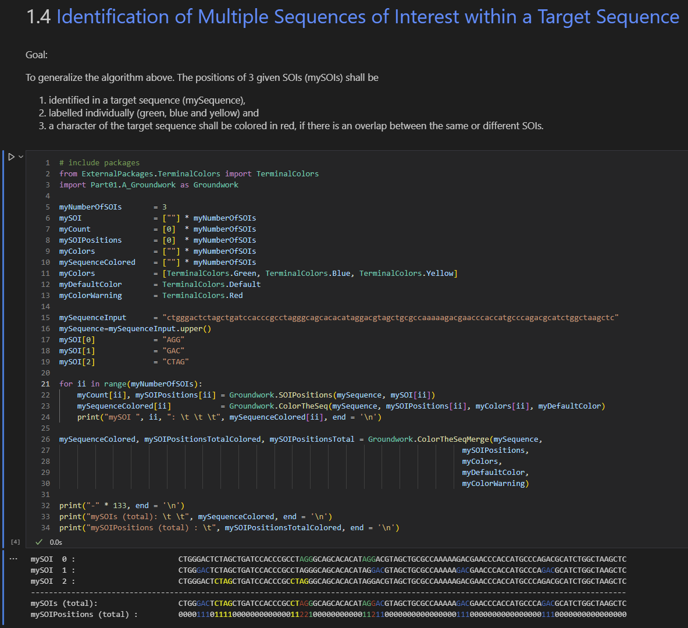

# Sequence Analysis (in Progress)

# Abstract
This project aims at the principles of analysing (DNA-) sequence data. The underlying data can be obtained freely from many scientific bioinformatics databases (check out my website www.bio-century.net for further info). This "Part 1" is a collection of Python-based example codes focussing on sequence analysis on a very basic level. More parts are to come soon...<br>
Goals and example code is presented in a Jupyter-Notebook-(.ipynb-)fileformat. Jupyter-NB or equivalent extensions in the IDE of your choice is thus required to modify it.
<br><br>
Coding example:<br>
<br>


# Table of Content
- [Sequence Analysis (in Progress)](#sequence-analysis-in-progress)
- [Abstract](#abstract)
- [Table of Content](#table-of-content)
  - [ Getting Started](#-getting-started)
    - [ Inspirations \& ToDo's](#-inspirations--todos)
  - [ Folder structure](#-folder-structure)
  - [ Requirements](#-requirements)
  - [ License](#-license)
  - [ Contributors \& Acknowledgments](#-contributors--acknowledgments)
  - [ Sources](#-sources)
  - [ Contact](#-contact)


## <a id='GettingStarted'></a> Getting Started
All you need is a running jupyter notebook distribution of some sort as well as python fulfilling the requirements listed in section [ Requirements](#-requirements). Strongly recommended is vs code with it's .ipynb-extension 


### <a id='InspirationsAndToDos'></a> Inspirations & ToDo's
Here is room for your inspiration, which is very much appreciated! Please be patient as concerns implementationof your ideas, since the resources (time and personnel) are limited.
- [ ] Progress in groundwork towards NGS-sequencing
- [ ] Next Idea 1
- [ ] Next Idea 2
- [ ] ...


## <a id='FolderStructure'></a> Folder structure
```
|   LICENSE
|   README.md
|   SequenceAnalysis.html                                  html-transformed output of the .ipynb-file for representation purposes
|   SequenceAnalysis.ipynb                                 Main .ipynb-file explaining tasks and giving example code to solve them
|
+---ExternalPackages
|   |   TerminalColors.py                                   External package defining the colors used to print sequences in the Jupyter-Notebook-terminal
|   \---__pycache__ +++                                     (COLLAPSED): Auto-generated pycache
|
+---Figures +++                                             (COLLAPSED): Example images for clarification
|
+---Figures_scientific
|
+---Icons +++                                               (COLLAPSED): Icons / Logos of bio-century.net
|
+---ModulesExternal
|
+---ModulesOwn                                              Functions / methods developed for Sequence Analysis
|   |   A_Groundwork.py
|   |   B_SimpleTabbedGUI.py
|   |   D_KmerAnalysis.py
|   |
|   +---A_Groundwork_Data
|   +---B_SimpleTabbedGUI_Data
|   +---D_KmerAnalysis
|   \---__pycache__                                         (COLLAPSED): Auto-generated pycache
|
+---requirements
|   \---requirements.txt                                    (COLLAPSED): Auto-generated pycache
|
\---_themes +++                                             (COLLAPSED) Themes for simple GUI in order to make the window look nicer
```
[//]: # (tree /a /f)


## <a id='Requirements'></a> Requirements
Listed in ```./requirements/requirements.txt```


## <a id='License'></a> License
This work is published under the GPL-2.0 license.


## <a id='ContributorsAcknowledgments'></a> Contributors & Acknowledgments
Many thanks to the comber.io admin for inspirations, code reviews and for initializing the bio-century.net website.


## <a id='Sources'></a> Sources
Sources are given directly in the respective code sections.


## <a id='Contact'></a> Contact
info@bio-century.net